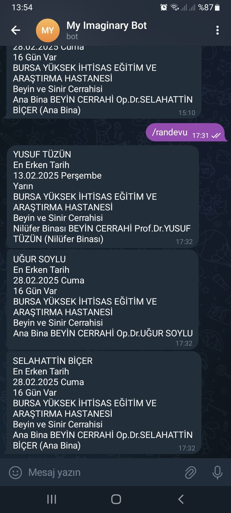

# MHRS Randevu Tarayıcı ve Telegram Bildirim Botu

Bu proje, Python kullanarak MHRS (Merkezi Hekim Randevu Sistemi) üzerinde belirlenen kriterlere göre randevu arayan ve uygun bir randevu bulunduğunda Telegram üzerinden bildirim gönderen bir sistemdir.

## Özellikler
- **Otomatik Tarama:** MHRS sisteminde belirlenen kriterlere göre randevu arar.
- **Telegram Bildirimi:** Uygun bir randevu bulunduğunda veya '/randevu' komudu ile Telegram üzerinden mesaj gönderir.
- **Esnek Konfigürasyon:** Kullanıcı, hastane, bölüm ve tarih aralığını belirleyebilir.
- **Kolay Kullanım:** Basit bir yapılandırma dosyası ile kişiselleştirilebilir.

## Görseller

  

## Lisans
Bu proje MIT Lisansı ile lisanslanmıştır.

